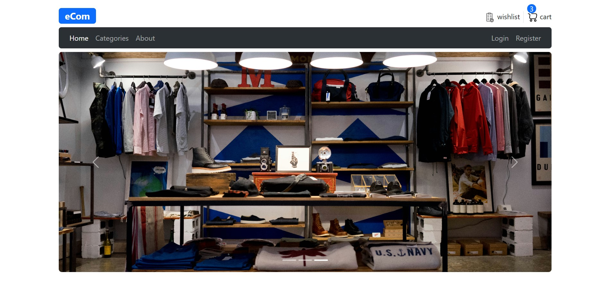
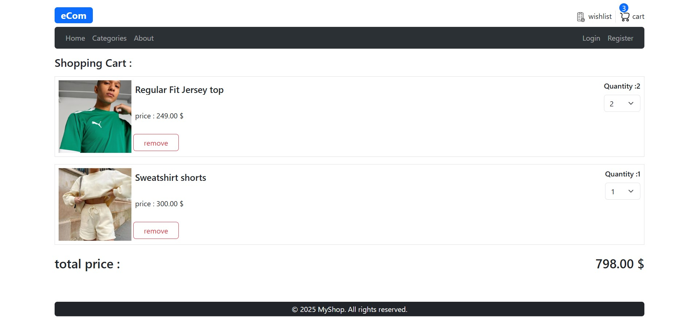
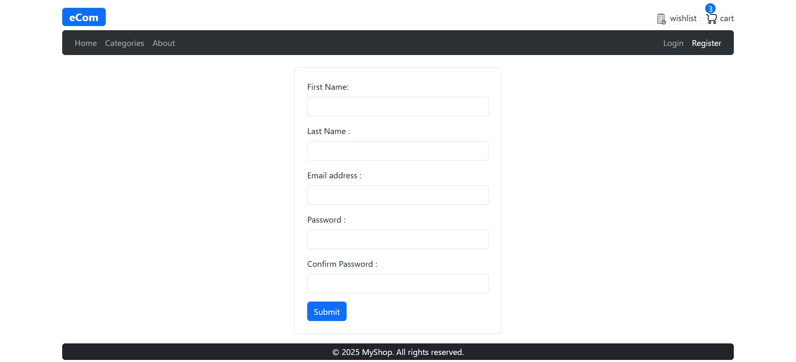

# E-Commerce Web Application

A production-ready e-commerce web application built with React and TypeScript, 
focusing on real-world business features and scalable state management.

## 🚀 Live Demo
[Live Demo](PUT_YOUR_LINK_HERE)

## 📸 Screenshots

## 🧠 Overview
This project simulates a real e-commerce platform to practice building scalable 
frontend architecture, handling global state, and implementing common user flows 
found in production applications.

## ✨ Features
- User authentication (login / register)
- Protected routes
- Product listing and filtering
- Persistent shopping cart
- Responsive UI
- Loading and error handling

## 🛠 Tech Stack
- React.js
- TypeScript
- Redux Toolkit
- Tailwind CSS / Material UI
- Framer Motion

## 🧩 Architecture Decisions
- Used Redux Toolkit for predictable and scalable state management.
- Structured the project using reusable components and feature-based folders.
- Focused on clean code and performance optimization.

## 📈 What I Learned
- Managing complex application state
- Building real-world user flows
- Structuring React projects for scalability

## 📌 Future Improvements
- Integrate real backend APIs
- Add pagination and advanced filtering
- Improve accessibility          
